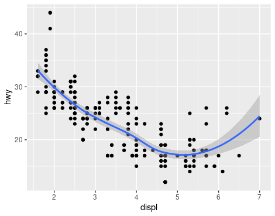
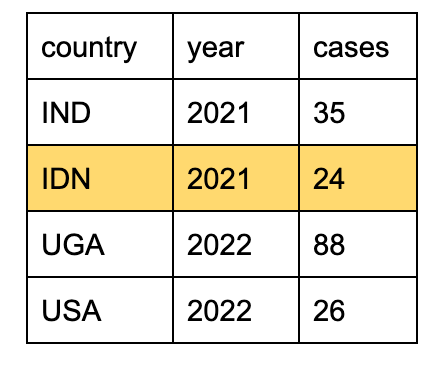
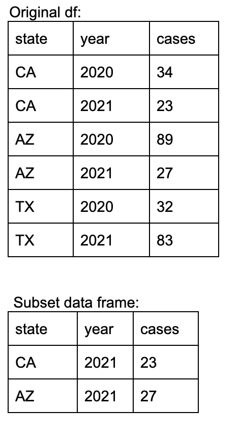

```{r setup, include=FALSE}
knitr::opts_chunk$set(echo = FALSE)
library(tidyverse)
library(lubridate)
```


# Instructions

This Rmd is your midterm exam. Submit your completed exam by knitting this Rmd to PDF and loading to Gradescope by 11:59 Pacific time on Tuesday,  October 25.

When completing this Rmd, please include your answer for each question where it says **ANSWER HERE:**. For questions 11-20, please also provide your code in the indicated code chunks. The code portion will be used to assign partial credit. 

When you are done with the exam, please be sure to knit the Rmd directly to PDF. Additionally, keep in mind best practices including ensuring code does not run of the page and not printing entire dataframes within your final PDF. **When knitted, your PDF should be approximately one page per question** (points will be deducted if too long with unnecessary output). _(Note: some of the formatting for multiple choice questions may be off when you knit - that is OK)_


## Contents

- SECTION 1 - Multiple Choice - 10 pts
- SECTION 2 - Short Answer - 15 pts
- EXTRA CREDIT - 2 pts

# SECTION 1 - Multiple Choice

**[1 pt each, 10 total]** Each multiple choice question has only one correct answer, unless otherwise specified. Type the letter corresponding to the correct answer(s) after **ANSWER HERE:**. Please do **not** include any of your code/work for this section. 

\newpage

## Question 1

Which of the following will return a value of TRUE when evaluated in R?

x <- 6    
y <- 36

A.  x*x = y
B.  x^2>y 
C.  x != y 
D.  y<x 


**ANSWER HERE:** 
**C**

\newpage

## Question 2

With the lubridate package installed, you have a character vector my_date which contains a date in yyyy-mm-dd format.  Which code would correctly yield the last day of the month for my_date?

A.    dmy(my_date) + months(1) - days(1)
B.    ceiling_date(dmy(my_date), "month") %m-% days(1)
C.    as_date(my_date) + months(1) - days(1)
D.    ceiling_date(as_date(my_date), "month") %m-% days(1)

**ANSWER HERE:** 
**D**

\newpage

## Question 3

We are interested in subsetting a hypothetical dataframe (called `df`) to only include rows for where city is Los Angeles, Santa Barbara, San Bernardino, or San Diego. Please select the missing code that will make this code operational:

subsetted_df<- filter(df, _MISSING CODE_) 

A.    city %in% "Los Angeles","Santa Barbara", "San Bernardino", "San Diego"
B.    city == c("Los Angeles","Santa Barbara", "San Bernardino", "San Diego") 
C.    city in c("Los Angeles","Santa Barbara", "San Bernardino", "San Diego")
D.    city %in% c("Los Angeles","Santa Barbara", "San Bernardino", "San Diego")

**ANSWER HERE:** 
**D**

\newpage

## Question 4

Which code will create a vector with the following contents?

6, 12, 18, 24, 30

A.    seq(6, 30, by=5)
B.    6:30
C.    seq(6, 30, length.out=5)
D.    multiple(6, 30)

**ANSWER HERE:** 
**C**

\newpage

## Question 5

Which of the code blocks below creates the following plot?



A.    ggplot(data = mpg, mapping = aes(x = hwy, y = displ)), geom_point(), geom_smooth()

B.    ggplot(data = mpg, mapping = aes(x = displ, y = hwy)) +
        geom_point() +
        geom_smooth()

C.    mpg %>%
        select(displ, hwy) %>%
        ggplot(mapping = aes(x = hwy, y = displ)) + 
        geom_point() + 
        geom_smooth()

D.    ggplot(data = mpg, mapping = aes(x = hwy, y = displ)) %>%
        geom_point() %>% 
        geom_smooth()

**ANSWER HERE:** 
**B**

\newpage

## Question 6

For the list that is generated by this code:

multi_list <- list("Numbers" = seq(2,22,by=2), 
  "Matrix" = matrix(c(-2,5,8,7,4,22), nrow = 2),
  "Words"=list("two","four","six", "eight"))

Which of the following will **not** return a single value of 8? 

A.    multi_list[["Numbers"]][4]
B.    multi_list[[2]][1,2]
C.    length(multi_list[["Matrix"]])
D.    multi_list[[1]][4]

**ANSWER HERE:** 
**C**

\newpage

## Question 7

Data frames and tibbles are two options for storing tabular data in R. What distinguishes data frames and tibbles from one another? Select **all** that apply.

A.    Tibbles have less flexibility than data frames for naming columns (i.e. allowing spaces and symbols)
B.    Data frames always have row names and tibbles do not
C.    Both data frames and tibbles have row names
D.    The output will include the data type for each column when printing a tibble, which is not the case when printing data frames

**ANSWER HERE:** 
**B,D**

\newpage

## Question 8

Using the dataframe (`df`) below, which of the following will return the **highlighted row** in the dataframe?



A.    df[ , 2]
B.    unlist(df[2, 0])
C.    df[which(df$county=="IDN"),]
D.    df[2, ]

**ANSWER HERE:** 
**D**

\newpage

## Question 9

Using the df below, which of the following will **not** return this subset data frame?



A.    `df[which(df$year==2021 & df$cases < 30),]`
B.    `df %>% filter(year==2021 | state %in% c("CA","AZ"))`
C.    `df %>% filter(year==2021 & cases <30)`
D.    `subset(df,year==2021 & cases < 30)`

**ANSWER HERE:** 
**B**

\newpage

## Question 10

There is a need to calculate a temperature in Celcius from Farhenheit  ((°Fahrenheit x 5) / 9). If the Celcius temperature is less than or equal to 0°C, the code should print “too cold”, if it is greater than or equal to 30°C it should print “too hot”, and if it is between 0°C and 30°C, it should print “just right”.

Which block of code will print the correct value when

tempC <- ((tempF - 32) * 9)

A. if(tempC >= 30) {
    print("too hot")
    } else (tempC <= 0){
    print("too cold")
    } else {
    print("just right")}

B. if(tempC >= 30) {
    “too hot"
    } else if (tempC <= 0){
    "too cold"
    } else {
    "just right"}

C. if{tempC >= 30} (
    print("too hot")
    ) else if {tempC <= 0{(
    print("too cold")
    ) else (
    print("just right"))

D. if(tempC >= 30) {
    print("too hot")
    } else if (tempC <= 0){
    print("too cold")
    } else {
    print("just right")}

**ANSWER HERE:** 
**D**


\newpage

# SECTION 2 - Short Answer

**[15 points total]**
All questions below should be answered using R. Unless otherwise specified, you may use any method (base R, tidyverse, or other) to answer these questions.

Please type out your answers in the specified area **ANSWER HERE:** (even if the answer is also available in your code chunk). Code will be used to give partial credit for incorrect answers.  

For all questions below, use the “ed_facility_ca.csv” file that is saved on DataHub/GitHub at PHW251_Fall2022/midterm/data/ed_facility_ca.csv. This is a real dataset from the California Health and Human Services Open Data Portal, but has been altered slightly for the purpose of this exam. The dataset contains counts of emergency department encounters at California medical facilities. 

The file includes the following columns:

-   **Year** 
-   **OSHPD ID**
-   **Facility Name**
-   **County Name**
-   **ER Service Level Desc:** Level of ER service. Options include - BASIC, COMPREHENSIVE, STANDBY, NOT APPLICABLE
-   **Type:** Specifies encounter type. Options include - ED_Visit (Encounter in which patient is treated in the Emergency Department and then released), ED_Admit (Encounter in which the patient is initially treated in the Emergency Department and then admitted to the same hospital for continued inpatient care). Categories are mutually exclusive.
-   **Count**

\newpage

## Question 11

Import the csv data file.

What are the data types of each column when you read the data into R (numeric, factor, logical, character, etc)? **[1 pt]**

**ANSWER HERE:**

-   Year: ____numeric____ 
-   YOSHPD ID: ____numeric___ 
-   Facility Name: ____character____ 
-   County Name: ____character___ 
-   ER Service Level Desc: ____character____ 
-   Type: _____character___ 
-   Count: ____numeric____ 

```{r q11a_work, echo=T}

ed_path = 'data/ed_facility_ca.csv'
ed_tib = read_csv( ed_path )

str(ed_tib)

```

\newpage

## Question 12
Notice the column names are not reading in in  very user-friendly way. Rename all columns to align with best practices for naming columns (lowercase with underscores in place of spaces). 

Paste the new column names **and** the line(s) of code you used to change them below. **[1 pt]**

**ANSWER HERE:**  
"year"                  "oshpd_id"              "facility_name"         
"county_name"           "er_service_level_desc"
type"                   "count"     

ed_tib2 = ed_tib %>% rename_with( ~ tolower( gsub(" ","_", .x, fixed=TRUE) ))

```{r q12_work, echo=T}

ed_tib2 = ed_tib %>% rename_with( ~ tolower( gsub(" ","_", .x, fixed=TRUE) ))
colnames(ed_tib2)

```


\newpage

## Question 13

**Questions 13 through 17 are designed to build off each other.**

Using the dataset from question 12, create a new data frame that limits the dataset to only contain rows where the type of service was “basic” and year is between 2015 and 2020.

How many records are in the new subsetted dataset? **[1 pt]**

**ANSWER HERE:** 
**3340**

```{r q13_work, echo=T}

ed_tib3 = ed_tib2 %>% filter(
  str_to_lower( er_service_level_desc ) == "basic" &
  year >= 2015 & year <= 2020  
)
length(ed_tib3$oshpd_id)
```

\newpage

## Question 14, Part A

Using the data frame created in question 13, create a new column called `total_encounters` by grouping OSHPD ID and Year and then summing the values in the `count` column to get total encounters. 

_(Hint: After adding this column your data frame should contain the same number of rows that it had before you added the column.)_ 

What is the value of `total_encounters` for Alameda Hospital in 2020? **[1 pt]**

**ANSWER HERE:** 
**12115**


```{r q14a_work, echo=T}
ed_tib4 = ed_tib3 %>% 
  group_by( oshpd_id, year ) %>% 
  summarize( total_encounter = sum( count ), 
             count, type, facility_name, county_name, er_service_level_desc )  

# double check against hint, indeed still have 3340 rows
length(ed_tib4[[1]])   

# What is the value of `total_encounters` for Alameda Hospital in 2020?
ed_tib4[which( ed_tib4$facility_name=="ALAMEDA HOSPITAL" & ed_tib4$year==2020), ] 
```

\newpage

## Question 14, Part B

Then create another new column called `pct_encounter_type` that calculates the percent of ED encounters of each type (visits or admits) for each facility and year.  Display the percentage as multiplied by 100 and rounded to 1 decimal (for example, 35.1% would be displayed as 35.1). 

What is the value of `pct_encounter_type` for ED admits at Sutter Davis Hospital in 2015? **[1 pt]**

**ANSWER HERE:** 
**6.1%**

```{r, echo=T}
ed_tib5 = ed_tib4 %>% 
  mutate(
    pct_encounter_type = round( ( (count/total_encounter) * 100 ), 1 )
  )
  
ed_tib5 %>% select( type, oshpd_id, year, pct_encounter_type ) %>% head(4)
 
# What is the value of `pct_encounter_type` for ED admits at Sutter Davis Hospital in 2015? 
ed_tib5[which( str_to_lower(ed_tib5$facility_name) == "sutter davis hospital" 
                          & ed_tib5$year == 2015
                          & ed_tib5$type == "ED_Admit")
        , ] %>% 
  pull(pct_encounter_type)
```

\newpage

## Question 15, Part A

Using the data frame created in question 14, first create a subset data frame that only includes rows for ED admits. Then use the arrange function to order the data frame to display rows first by lowest to highest year and then by highest to lowest value of `pct_encounter_type`.  Show a single line of code that can be used for this arrange step. **[1 pt]**

**ANSWER HERE:** 
**arrange( year, desc(pct_encounter_type)  )**

```{r q15a_work, echo=T}

ed_tib6 = ed_tib5 %>% 
  filter(  str_to_lower(type) == "ed_admit"  ) %>%
  arrange( year, desc(pct_encounter_type)  )

length(ed_tib6[[1]])  ## cross check, got 1670 rows, half of before, as expected.

ed_tib6 %>% head

```

\newpage

## Question 15, Part B

What code would you use to obtain only the facility names for the first 5 rows of the dataset created in question 15A (facilities with highest values in the `pct_encounter_type` column for the first year in the data frame)?  **[1 pt]**

**ANSWER HERE:** 
**ed_tib6 %>% head(5) %>% pull( facility_name )**

```{r q15b_work, echo=T}

ed_tib6 %>% head(5) %>% pull( facility_name )


```


\newpage

## Question 16, Part A

Using the data frame created in question 15A, find the average (mean) value of percent of encounter types (`pct_encounter_type`) that were admits among all facilities from 2015-2020. Use this mean value to create another new column called `above_below_avg` that categorizes facilities with `pct_encounter_type` equal to or above average as “above”; otherwise, categorize as “below”.

What is the average (mean) percentage of encounters that are ED admits for all facilities from 2015-2020? **[1 pt]**

**ANSWER HERE:** 
**13.8%**

```{r q16a_work, echo=T}

mean_pct_encounter_type = mean( ed_tib6$pct_encounter_type )
mean_pct_encounter_type

ed_tib_q16a = ed_tib6 %>% 
  mutate( above_below_avg = case_when(
    pct_encounter_type >= mean_pct_encounter_type ~ "above",
    TRUE                                          ~ "below"
  ))

```

\newpage

## Question 16, Part B

Using the data frame created in question 16A, What is the value of `above_below_avg` for ED admits at West Anaheim Medical Center for 2016? **[1 pt]**

**ANSWER HERE:** 
**above**

```{r q16b_work, echo=T}
( ed_tib_q16b = ed_tib_q16a[ which( 
  str_to_lower( ed_tib_q16a$facility_name) == "west anaheim medical center" 
             &  ed_tib_q16a$year == 2016
             &  ed_tib_q16a$type == "ED_Admit"
  ), ] )

# What is the value of `above_below_avg` for ED admits at West Anaheim Medical Center for 2016? 
ed_tib_q16b$above_below_avg 

```

\newpage

## Question 17, Part A

Restrict the dataset created in 16A to only include records for San Diego, Orange County, and Los Angeles facilities for the year 2020.

How many records remain? **[1 pt]**

**ANSWER HERE:** 
**104**


```{r q17a_work, echo=T}

ed_tib_q17a = ed_tib_q16a %>%
  filter( 
    str_to_lower( county_name ) %in% c( "san diego", "orange", "los angeles"  ) 
    &  year == 2020
    )

length(ed_tib_q17a[[1]])
ed_tib_q17a %>% head

```

\newpage

## Question 17, Part B

Using the data frame created in question 17A, what hospital in those counties has the highest percent of encounters that are admits in 2020? **[1 pt]**

**ANSWER HERE:** 
**College Medical Center**

```{r q17b_work, echo=T}
ed_tib_q17b = ed_tib_q17a %>%
  arrange( desc(pct_encounter_type) ) %>% 
  head(1)

ed_tib_q17b
```

\newpage

## Question 18

Question 18 & 19 utilize the dataframe you imported in questions 11 & 12. 
To start, create a new subset dataframe that only includes records for encounters that were ED visits (not admits) in the year 2020. 
Additionally, only include the following columns: Facility Name, County, ER Service Level visits, Type, and Count. 

Create a new column called `county_visit_total` that contains the total number of ED visits for each county. _(Hint: after this step, this data frame should contain 1 row per county.)_ 

Re-order the table to display the county with the highest number of ED visits at the top of the table. What county has the 10th highest total number of ED visits in 2020? **[1 pt]**

**ANSWER HERE:** 
**Kern**

```{r q18_work, echo=T}

ed_tib_q12 = ed_tib2

ed_tib_q18 = ed_tib_q12 %>%
  filter( year == 2020 &
          str_to_lower( type ) == "ed_visit" ) %>%
  select( "facility_name", "county_name", "er_service_level_desc", "type", "count" )

ed_tib_q18_partB = ed_tib_q18 %>%
  group_by( county_name ) %>%
  summarize( county_visit_total = sum( count ) ) %>%
  arrange( desc( county_visit_total ))

ed_tib_q18_partB %>% 
  head(10)       %>%   # top 10
  tail( 1)             # the last one of the top 10

# cross check
unique( ed_tib_q12$county_name ) %>% length() ## originally had 55 counties only

```

\newpage

## Question 19

Building on to the data frame created in question 18, create a new column called `visit_category` indicating the categorical level of ED visits utilization (High, Medium, Low, Very Low)  in each county. The categories should be defined as:

-   “High”: > 178649 ED visits
-   “Medium”: > 66521 ED visits
-   “ Low”: > 22026 ED visits
-   “Very Low”: <= 22026  ED visits

Create a final table that summarizes the number of counties in each category _(Hint: this table should only have 4 rows)_.

How many counties are in the “low” coverage category?  **[1 pt]**
**14**

**ANSWER HERE:** 


```{r q19_work, echo=T}

ed_tib_q19 = ed_tib_q18_partB %>% 
  mutate( visit_category = case_when(
    county_visit_total >  178649                                ~ "High",
    county_visit_total <= 178649 & county_visit_total >  66521  ~ "Medium",
    county_visit_total <=  66521 & county_visit_total >  22026  ~ "Low",
    TRUE                                                        ~ "Very Low"     
  ))

# Create a final table that summarizes the number of counties in each category.
ed_tib_q19_sum = ed_tib_q19  %>% 
  group_by( visit_category ) %>%
  summarize( num = n() )
ed_tib_q19_sum


# How many counties are in the “low” coverage category? 
num_low_cat = ed_tib_q19[which( ed_tib_q19$visit_category == "Low"), ] %>% tally()
num_low_cat


```

\newpage

## Question 20, Part A

Question 20 utilizes the dataset as it was first imported in question 11 & 12. 

Create a subset dataset with only records for 2016 and basic ER service level. 
Keep only the following columns: Facility Name, County Name, Type, and Count. 
Pivot the dataset to create columns for each of the ED encounter types; these columns should each contain the counts of encounters for each type (admit and visit). 

How many records are in the dataset after the pivot? **[1 pt]**

**ANSWER HERE:** 
**278**

```{r, echo=T}
ed_tib_q20 = ed_tib_q12 %>%
  filter( year == 2016 & 
          str_to_lower( er_service_level_desc ) == "basic"  ) %>%
  select( "facility_name", "county_name", "type", "count" )   %>%
  pivot_wider( names_from="type", values_from="count")

ed_tib_q20 %>% head()

# How many records are in the dataset after the pivot? 
length( ed_tib_q20[[1]] )

```

\newpage

## Question 20, Part B

Include the line of code used to perform the pivot. Make sure to include the function name as well as the arguments used. *[1 pt]*

**ANSWER HERE:** 
**pivot_wider( names_from="type", values_from="count")**


\newpage

# EXTRA CREDIT

**[2 points total]**

Complete questions #18 and #19 using only one dplyr call. In other words, start with the dataset imported in question 11, perform the necessary subsetting, grouping, and summarizing with the end goal of producing a table that displays the number of counties in each visit count category. 

Please include sufficient code for the teaching team to be able to run your code, if needed. This means either including the import statement for the csv before the dplyr call, or including the import statement as part of your dplyr call. 

Hint: Including more than one `group_by()` in a single call may also require the use of `ungroup()`. 

Paste the single dplyr call below. **[1 pt]**
mega_result = read_csv( 'data/ed_facility_ca.csv', show_col_types=FALSE ) %>% 
  rename_with( ~ tolower( gsub(" ","_", .x, fixed=TRUE) )) %>%
  filter( year == 2020 &
          str_to_lower( type ) == "ed_visit" ) %>%
  select( "facility_name", "county_name", "er_service_level_desc", "type", "count" ) %>%
  group_by( county_name ) %>%
  summarize( county_visit_total = sum( count ) ) %>%
  arrange( desc( county_visit_total )) %>%
  mutate( visit_category = case_when(
    county_visit_total >  178649                                ~ "High",
    county_visit_total <= 178649 & county_visit_total >  66521  ~ "Medium",
    county_visit_total <=  66521 & county_visit_total >  22026  ~ "Low",
    TRUE                                                        ~ "Very Low"
  )) %>%
  group_by( visit_category ) %>%
  summarize( num = n() )


```{r bonus_a, echo=T}
library(dplyr)

mega_result = read_csv( 'data/ed_facility_ca.csv', show_col_types=FALSE ) %>% 
  rename_with( ~ tolower( gsub(" ","_", .x, fixed=TRUE) )) %>%
  filter( year == 2020 &
          str_to_lower( type ) == "ed_visit" ) %>%
  select( "facility_name", "county_name", "er_service_level_desc", "type", "count" ) %>%
  group_by( county_name ) %>%
  summarize( county_visit_total = sum( count ) ) %>%
  arrange( desc( county_visit_total )) %>%
  mutate( visit_category = case_when(
    county_visit_total >  178649                                ~ "High",
    county_visit_total <= 178649 & county_visit_total >  66521  ~ "Medium",
    county_visit_total <=  66521 & county_visit_total >  22026  ~ "Low",
    TRUE                                                        ~ "Very Low"
  )) %>%
  group_by( visit_category ) %>%
  summarize( num = n() )

mega_result
```


\newpage

Include code that uses the `kable` package to print the final table for question 19 in a print-friendly format (easy to read with meaningful column names and rows in descending order from High to Very Low).  **[1 pt]**

```{r bonus_b, echo=T}

library( kableExtra )
kable( mega_result,
       booktabs = T, 
       col.names = c( "Visit Category", "Number of Counties" ),
       align = "rl",
       caption = "Calif Emergency Dept visit by category, 2020",
       digits = 0 
       )
```


