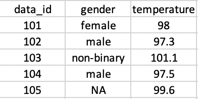

* Due date: Monday, September 20
* Submission process: Please submit your assignment directly to Gradescope. You can do this by knitting your file and downloading the PDF to your computer. Then navigate to Gradescope.com or via the link on BCourses to submit your assignment. 

Helpful hints:

- Knit your file early and often to minimize knitting errors! If you copy and paste code from the slides, you are bound to get an error that is hard to diagnose. Typing out the code is the way to smooth knitting. We recommend knitting your file each time after you write a few sentences/add a new code chunk, so you can detect the source of the knitting error more easily. This will save you and the teaching team time!

- Please make sure that your code does not run off the page of the knitted PDF. If it does, we can't see your work. To avoid this, have a look at your knitted PDF and ensure all the code fits in the file. When it doesn't, go back to your .Rmd file and add spaces (new lines) using the return or enter key so that the code runs onto the next line.

--------------------------------------------------------------------------------

\newpage 

### Question 1

In this question you will create a data frame. Below is code for how to do this:
```{r df_example}
# data frame with three columns and three rows
# notice how we start with the column name and then the row values
# each column, in this example, has three values
df_example <- data.frame("column_1" = 1:3, 
                         "column_2" = c("string_1", "string_2", "2"), 
                         # here we add an NA value due to missing data
                         "column_3" = c(NA, "string_3", 50))
df_example
```


Now you try! Create a data frame with three columns and the following values:

- Column 1: ID

  1, 2, 3
  
- Column 2: NAME

  "Pam", "Jim", "Dwight"
  
- Column 3: AGE

  40, NA, 48

```{r office_df}
# your code here
dunder_mifflin <- data.frame("id" = 1:3, 
                             "Name" = c("Pam", "Jim", "Dwight"), 
                             "Age" = c(40, NA, 48))
dunder_mifflin
```

\newpage

### Question 2

With your new data frame created in the previous question, find the following values:
  - length
  - typeof
  - class
  
```{r office_values}
# your code here
length(dunder_mifflin) # 3
typeof(dunder_mifflin) # list
class(dunder_mifflin) # data.frame
```

\newpage

### Question 3

Create a data frame and a tibble that matches the image below:

```{r show_table}
# by the way, you can load images into rmarkdown! Cool, right?!
# here we use the knitr library (though there are multiple ways to load images)
library(knitr)

# notice that we specify the path to look within the current directory
# by using the period: .
# followed by a slash: / to pull the image file

```

Hint: You may need to load a library for tibbles.
```{r tibble}
# your code here
library(tidyverse)

df <- data.frame(
  id = 101:105,
  gender = c("female", "male", "non-binary", "male", NA),
  temperature = c(98, 97.3, 101.1, 97.5, 99.6))
df

tib <- tibble(
  id = 101:105,
  gender = c("female", "male", "non-binary", "male", NA),
  temperature = c(98, 97.3, 101.1, 97.5, 99.6))
tib
```

\newpage

### Question 4

What are the key differences between data frames and tibbles? 

Tibbles are a modern re-imagining of the data frame. The main differences are how tibbles print and subset.

When you print a tibble, it only shows the first 10 rows and as many columns as will fit on your screen. It will also show you the type of each column, which doesn't happen when you print a normal data frame (you would have to use str() to get that information). 

Tibbles are more strict about subsetting, so using single square brackets [] will always return another tibble and using double square brackets [[]] will always return a vector. For example, tib[1,2] will return a tibble containing the element located at row 1, column 2 in tib. tib[[1,2]] will return a vector of that element.
```{r}
tib[1,2]
tib[[1,2]]
```


Why are tibbles preferable?

Tibbles don't do a few things many users find annoying about data frames:

 - Tibbles don't change the type of inputs (e.g. strings to factors)
 - Tibbles don't change the names of variables
 - Tibbles never create row.names()

Tibbles have friendly features baked in, but you may encounter bugs with the tibble format and older packages that haven't been updated. You change a tibble into a data frame with as.data.frame().

To learn more about tibbles [click here](https://blog.rstudio.com/2016/03/24/tibble-1-0-0/) and/or run vignette("tibble").


\newpage

### Question 5

We just found out results for COVID testing and want to add it to our data. Using the tibble you created in Question 3, add the following test results to a new column called "results".

- 101 = NEGATIVE
- 102 = POSITIVE
- 103 = NEGATIVE
- 104 = NEGATIVE
- 105 = NEGATIVE

```{r covid_results}
# your code here
tib$results <- c("NEGATIVE", "POSITIVE", "NEGATIVE", "NEGATIVE", "NEGATIVE")
tib
```

\newpage

### Question 6

You find out there was an error in data collection and subject 102's temperature is actually 98.3, not 97.3. Correct the value in your data frame.

```{r fix_covid_results}
# your code here
tib[2, 3] <- 98.3
tib
```

\newpage

### Question 7

Load the "stds-by-disease-county-year-sex.csv" data set, which is in the data folder. 

You can find more information about this data set from the California Open Data Portal:

https://data.ca.gov/dataset/stds-in-california-by-disease-county-year-and-sex

```{r import_stds}
library(readr)

# your code here
stds <- read_csv("./data/stds-by-disease-county-year-sex.csv",
                 skip = 3)
```

You may have noticed that there are empty cells in the first three rows. Modify your code above (if you haven't already) to remove these rows.

\newpage

### Question 8
 
Let's explore this STD data set. **Use code** to find the values requested below. Insert R chunks as needed.

How many rows?
```{r}
str(stds)
```

9558

How many columns? 

6

What are the column names?

Disease, County, Year, Sex, Cases, Population

What are the column types?

chr, chr, num, chr, num, num

\newpage

### Question 9

You want to dig deeper into the data and focus on the years 2015 - 2018. Use the which() function to index which rows fit this year range and assign the results to a new data frame. To check whether this was done correctly you should expect the following dimensions: 2124 rows x 6 columns

```{r which}
# your code here
(stds_2008_2015 <- stds[which(stds$Year > 2014), ])

dim(stds_2008_2015)
```
\newpage

### Question 10

Your colleague is interested in this data set but hasn't setup their git repository. They ask you to help them out by exporting this new data set as a .csv file. Place your output in the /data folder.  

As a test, you can try to read in the .csv you created to make sure everything looks correct.

```{r export}
# your code here
write_csv(stds_2008_2015, "data/stds_2008_2015.csv")

import_test <- read_csv("data/stds_2008_2015.csv")
import_test
```
\newpage

### Question 11

Look up how to use the unique() function and run it on the County column of the STD data set. You should see a total of 59 counties.
```{r unique}
# your code here
unique(stds$County)
```

You decide to focus on one county. Subset your data for one county of your choice.
```{r county_subset}
# your code here

# method 1: which
stds_subset <- stds[which(stds$County == "Alameda"), ]
stds_subset

# method 2: subset function
stds_subset2 <- subset(stds, County == "Alameda")
stds_subset2

# method 3: filter function (tidyverse - dplyr)
stds_subset3 <- filter(stds, County == "Alameda")
stds_subset3
```

\newpage

### Question 12

You're very interested in finding the rate of cases per 100,000 population. In your subset data frame (from the previous question), create a new column called "rate" with the calculated values. 

Rate = (Cases / Population) * 100,000

Hint: R allows you to use manipulate variables within a data frame to calculate new values so long as the rows and data types match up. For example: 
df$var3 <- df$var1 + df$var2

```{r rate}
# your code here
stds_subset$Rate <- (stds_subset$Cases / stds_subset$Population) * 100000
head(stds_subset)
```


You're done! Please knit to pdf and upload to gradescope. 