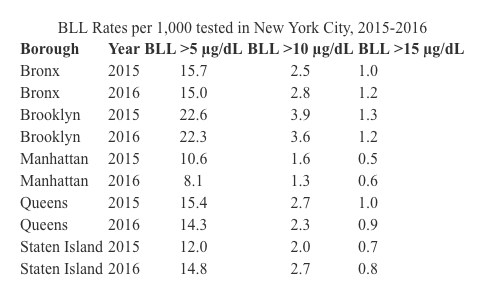

At this point in the course we have introduced a fair amount of code, which can be a lot to hold in our memory at once! Thankfully we we have search engines and these [helpful cheatsheets](https://rstudio.com/resources/cheatsheets/). You may find the Base R and Data Transformation Cheatsheet helpful.

```{r, include=FALSE}
library(tidyverse)
library(kableExtra)
```

\newpage


## Part 1

### Question 1

Use the readxl library and load two data sets from the "two_data_sheets" file. There's a parameter that you can specify which sheet to load. In this case, we have data about rat reaction time in sheet 1 and home visits in sheet 2.

```{r, echo=T, results="markup"}
# your code here
library(readxl)
data_file_path = "data/two_data_sheets.xlsx"
rxn_time   = read_xlsx( data_file_path, sheet=1 )
home_visit = read_xlsx( data_file_path, sheet=2 )

str(rxn_time)
str(home_visit)

# View( rxn_time )
# View( home_visit )

```

\newpage

### Question 2

For the rats data, pivot the data frame from wide to long format. We want the 1, 2, 3 columns, which represent the amount of cheese placed in a maze, to transform into a column called "cheese". The values in the cheese column will be the time, which represents the amount of time the rat took to complete the maze. Please use the `head()` function to print the first few rows of your data frame.

```{r}
# your code here
rxn_long = rxn_time %>% pivot_longer( c('1','2','3'), names_to="cheese_amount", values_to="time")
head(rxn_long)

```

\newpage 

### Question 3

Use `summarize()` to compute the mean and standard deviation of the maze time depending on the amount of cheese in the maze.

```{r}
# your code here
result = rxn_long %>% 
  summarize( mean_time=mean(time),
             std_dev_time=sd(time) )

result
```

\newpage

### Question 3

The home visits data is a record of how and where some interviews were conducted. Pivot the home visits data frame from long to wide. We want the names from the action column to become unique columns and the values to represent the counts. Please print your whole resulting data frame.

```{r}
# your code here
home_visit_wide = home_visit %>%
  pivot_wider( 
    names_from  = "action",  # "col_that_becomes_new_col_names" (would get as many new col as uniq values in the named col)
    values_from = "count"    #"col_with_data" 
    )

home_visit_wide

```
\newpage

## Part 2

For this part we will use data from [New York City](https://data.cityofnewyork.us/Health/Children-Under-6-yrs-with-Elevated-Blood-Lead-Leve/tnry-kwh5) that tested children under 6 years old for elevated blood lead levels (BLL). [You can read more about the data on their website]).

About the data:

All NYC children are required to be tested for lead poisoning at around age 1 and age 2, and to be screened for risk of lead poisoning, and tested if at risk, up until age 6. These data are an indicator of children younger that 6 years of age tested in NYC in a given year with blood lead levels (BLL) of 5 mcg/dL or greater. In 2012, CDC established that a blood lead level of 5 mcg/dL is the reference level for exposure to lead in children. This level is used to identify children who have blood lead levels higher than most children's levels. The reference level is determined by measuring the NHANES blood lead distribution in US children ages 1 to 5 years, and is reviewed every 4 years.

```{r loading, include=F}
file_path <- "data/Children_Under_6_yrs_with_Elevated_Blood_Lead_Levels__BLL_.csv"
bll_nyc <- read_csv(file_path) %>% drop_na()

colnames(bll_nyc) <- c("borough_id", "time_period", 
                       "bll_5", "bll_10", "bll_15", "total_tested")

# View(bll_nyc)
str(bll_nyc)

```

### Question 4

Recreate the below table with the "kable" pacakge.

```{r}



```

You will need to calculate the BLL per 1,000, filter for years 2015-2016, and rename the boroughs based on the following coding scheme:

* 1: Bronx
* 2: Brooklyn
* 3: Manhattan
* 4: Queens
* 5: Staten Island

First, filter your dataframe for the years 2015-2016 and rename the boroughs. If you make your borough names a factor, it will make your life easier when we create tables and graphs.
```{r}
# your code here

## there are 8 rows of data for borough_id=1 for 2015, 
## i guess  multiple test centers in the same borough
## thus need to add these rows up for summary data

nyc_borough_id = c( 1:5 )
nyc_borough_name = c( "Bronx", "Brooklyn", "Manhattan", "Queens", "Staten Island" )

draft_test_only_nyc_borough_fct = 
  factor( bll_nyc$borough_id, levels=nyc_borough_id, labels=nyc_borough_name ) 


Step1 = bll_nyc %>% 
    mutate( borough_fac = 
              factor( bll_nyc$borough_id, 
                      levels=nyc_borough_id, 
                      labels=nyc_borough_name )  ) %>%
    filter( time_period %in% c(2015,2016) ) 

# View(Step1)

```

Second, group and summarize the data to calculate the total *number* of children in each borough in each year that were tested and the number with blood lead levels that were greater than 5 mcg/dL, 10 5 mcg/dL, and 15 5 mcg/dL.
```{r}
# your code here

Step2 = Step1 %>% group_by( borough_fac, time_period ) %>% 
  summarize( sum_tested = sum( total_tested ),
             sum_bll_5  = sum( bll_5 ),
             sum_bll_10 = sum( bll_10 ),
             sum_bll_15 = sum( bll_15 ),
             )

bll_kab = Step2
# View( bll_kab )

```

Third, calculate the rate at which each blood lead level occurred in each year in each borough (BLL per 1,000).
```{r}
# your code here

Step3 = Step2 %>% mutate(
  rate_bll_5  = sum_bll_5  / sum_tested * 1000,
  rate_bll_10 = sum_bll_10 / sum_tested * 1000,
  rate_bll_15 = sum_bll_15 / sum_tested * 1000,
)

bll_kab = Step3 %>% select(
  borough_fac,
  time_period,
  rate_bll_5,
  rate_bll_10, 
  rate_bll_15,
)

```

Now we have calculated all the numbers we need to recreate the table shown at the beginning of this question. Use `kable()` to produce your table.
```{r}
# your code here


kable(bll_kab, 
      booktabs=T,
      escape=F,
      digits=1,
      col.names=c('Borough','Year','BLL>5mcg/dL','BLL>10mcg/dL','BLL>15mcg/dL'),
      align = "llccl",
      
      caption = "BLL Rates per 1,000 tested in New York City, 2015-2016",
      format="latex",
      #format="pipe"
     ) %>%
row_spec( 0, bold=T )     %>% # bold text for row #0
sub("\\\\toprule", "", .) %>%
sub("\\\\midrule", "", .) %>%
sub("\\\\bottomrule", "", .) 
# kable knitting to PDF was a bit annoying, screen output does not patch latex :-\
# the rule lines were removed per 
# https://edstem.org/us/courses/25507/discussion/1911419

# sorry, used mcg as my computer had problem knitting the greek letter mu.
```


\newpage

### Question 5

Replicate the following bar chart. Since we want the graph to have an ascending order, we will need to factor borough_id with the levels in a different order than the default. Note that this graph covers the whole time period from the original dataset!

[Here are the HEX codes used for the colors](https://colorswall.com/palette/454/):

* #ff6600: orange
* #003884: blue

```{r, out.width="100%"}
knitr::include_graphics('data/question_2_bar.png')
```

First, summarize the original dataset.
```{r}
# your code here
StepG1 = bll_nyc %>%
    mutate( borough_fac =
              factor( bll_nyc$borough_id,
                      levels=nyc_borough_id,
                      labels=nyc_borough_name )  )  

StepG2 = StepG1 %>% group_by( borough_fac ) %>%
  summarize( sum_bll_5  = sum( bll_5 ) ) 
  
plotdat = StepG2
plotdat

```

Then make the graph!
```{r}
# your code here

plotdat %>%
ggplot( 
       aes(x=fct_reorder(borough_fac, sum_bll_5),
           y=sum_bll_5, 
       )) +
  geom_bar( stat="identity",
           color = "#003884",  # blue, border, has to go first
           fill  = "#ff6600",  # orange fill the main bar
           lwd   = 1
            ) + 
  labs( x="boroughs", 
        y="counts of BLL > 5mcg/dL",
        title="New York City: Elevated Blood Lead Levels 2005-2016 by Borough") +
  theme_minimal() # +
  # theme(panel.border=element_rect(color="black",size=1))
  # pff... above create the border, but then the rest ofthe graph is blank :-\
  

```


You're done! Please knit to pdf and upload to gradescope. 

