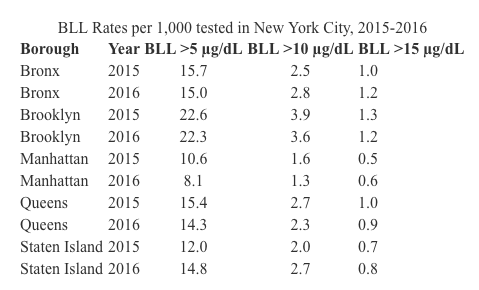
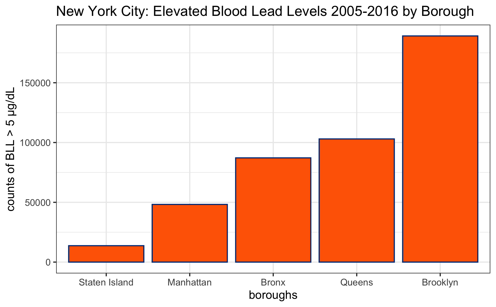

Due date: Monday, October 11th

At this point in the course we have introduced a fair amount of code, which can be a lot to hold in our memory at once! Thankfully we we have search engines and these [helpful cheatsheets](https://rstudio.com/resources/cheatsheets/). You may find the Base R and Data Transformation Cheatsheet helpful.

```{r, include=FALSE}
library(tidyverse)
library(kableExtra)
```

\newpage


## Part 1

### Question 1

Use the readxl library and load two data sets from the "two_data_sheets" file. There's a parameter that you can specify which sheet to load. In this case, we have data about rat reaction time in sheet 1 and home visits in sheet 2.

```{r, echo=T, results="markup"}
# your code here
library(readxl)
df_rats <- read_excel("data/two_data_sheets.xlsx", 1)
df_home <- read_excel("data/two_data_sheets.xlsx", 2)
```

\newpage

### Question 2

For the rats data, pivot the data frame from wide to long format. We want the 1, 2, 3 columns, which represent the amount of cheese placed in a maze, to transform into a column called "cheese". The values in the cheese column will be the time, which represents the amount of time the rat took to complete the maze. Please use the `head()` function to print the first few rows of your data frame.

```{r}
# your code here
df_rats$subject <- factor(df_rats$subject)
df_rats_long <- df_rats %>% 
  pivot_longer(c(`1`, `2`, `3`), names_to = "cheese", values_to = "time")

head(df_rats_long)
```

\newpage 

### Question 3

Use `summarize()` to compute the mean and standard deviation of the maze time depending on the amount of cheese in the maze.

```{r}
# your code here
df_rats_long %>%
  # organize by amount of cheese
  group_by(cheese) %>%
  # summarize
  summarize(mean = mean(time), # mean function
            sd = sd(time))     # standard deviation function
```

\newpage

### Question 3

The home visits data is a record of how and where some interviews were conducted. Pivot the home visits data frame from long to wide. We want the names from the action column to become unique columns and the values to represent the counts. Please print your whole resulting data frame.

```{r}
# your code here
df_home_wide <- df_home %>%
  pivot_wider(names_from = action, values_from = count)

df_home_wide
```
\newpage

## Part 2

For this part we will use data from [New York City](https://data.cityofnewyork.us/Health/Children-Under-6-yrs-with-Elevated-Blood-Lead-Leve/tnry-kwh5) that tested children under 6 years old for elevated blood lead levels (BLL). [You can read more about the data on their website]).

About the data:

All NYC children are required to be tested for lead poisoning at around age 1 and age 2, and to be screened for risk of lead poisoning, and tested if at risk, up until age 6. These data are an indicator of children younger that 6 years of age tested in NYC in a given year with blood lead levels (BLL) of 5 mcg/dL or greater. In 2012, CDC established that a blood lead level of 5 mcg/dL is the reference level for exposure to lead in children. This level is used to identify children who have blood lead levels higher than most children's levels. The reference level is determined by measuring the NHANES blood lead distribution in US children ages 1 to 5 years, and is reviewed every 4 years.

```{r loading, include=F}
file_path <- "data/Children_Under_6_yrs_with_Elevated_Blood_Lead_Levels__BLL_.csv"
bll_nyc <- read_csv(file_path) %>% drop_na()
colnames(bll_nyc) <- c("borough_id", "time_period", 
                       "bll_5", "bll_10", "bll_15", "total_tested")

```

### Question 4

Recreate the below table with the "kable" pacakge.

```{r}

```

You will need to calculate the BLL per 1,000, filter for years 2015-2016, and rename the boroughs based on the following coding scheme:

* 1: Bronx
* 2: Brooklyn
* 3: Manhattan
* 4: Queens
* 5: Staten Island

First, filter your dataframe for the years 2015-2016 and rename the boroughs. If you make your borough names a factor, it will make your life easier when we create tables and graphs.
```{r}
# your code here
bll_nyc2 <- bll_nyc %>% 
  filter(time_period %in% c("2015", "2016")) %>%
  mutate(borough_id = factor(borough_id, 
                             levels = c(1:5), 
                             labels = c("Bronx","Brooklyn", "Manhattan", 
                                        "Queens", "Staten Island"),
                             ordered=TRUE))

head(bll_nyc2)
```

Second, group and summarize the data to calculate the total *number* of children in each borough in each year that were tested and the number with blood lead levels that were greater than 5 mcg/dL, 10 5 mcg/dL, and 15 5 mcg/dL.
```{r}
# your code here
bll_nyc3 <- bll_nyc2 %>% 
  group_by(borough_id, time_period) %>%
  summarize(total_tested = sum(total_tested),
            bll_5 = sum(bll_5),
            bll_10 = sum(bll_10),
            bll_15 = sum(bll_15))

bll_nyc3
```

Third, calculate the rate at which each blood lead level occurred in each year in each borough (BLL per 1,000).
```{r}
# your code here
bll_nyc4 <- bll_nyc3 %>% mutate(bll_5_per_1k = round(bll_5/total_tested * 1000, 1),
                                bll_10_per_1k = round(bll_10/total_tested * 1000, 1),
                                bll_15_per_1k = round(bll_15/total_tested * 1000, 1))

bll_nyc4
```

Now we have calculated all the numbers we need to recreate the table shown at the beginning of this question. Use `kable()` to produce your table.
```{r}
# your code here

# select columns and change the year to character so it doesn't get a big.mark
bll_nyc5 <- bll_nyc4 %>% 
  select(borough_id, time_period, bll_5_per_1k, bll_10_per_1k, bll_15_per_1k) %>%
  mutate(time_period = as.character(time_period))

kable(bll_nyc5, 
      booktabs=T, 
      col.names=c("Borough", "Year", "BLL >5 µg/dL", "BLL >10 µg/dL", "BLL >15 µg/dL"),  
      align='lcccc', 
      caption="BLL Rates per 1,000 tested in New York City, 2015-2016",
      format.args=list(big.mark=",")) 
```


\newpage

### Question 5

Replicate the following bar chart. Since we want the graph to have an ascending order, we will need to factor borough_id with the levels in a different order than the default. Note that this graph covers the whole time period from the original dataset!

[Here are the HEX codes used for the colors](https://colorswall.com/palette/454/):

* #ff6600: orange
* #003884: blue

```{r, out.width="100%"}

```

First, summarize the original dataset.
```{r}
# your code here
# summarize all BLL > 5 in each borough
bll_nyc_bar <- bll_nyc %>% group_by(borough_id) %>% 
  summarise(bll_5 = sum(bll_5))

# change the order of factor
bll_nyc_bar$borough_id <- factor(bll_nyc_bar$borough_id,
                                 levels = c(5,3,1,4,2), #"2","3","1","4","5"
                                 labels = c("Staten Island","Manhattan",
                                            "Bronx", "Queens", "Brooklyn"),
                                 ordered=TRUE)
```

Then make the graph!
```{r}
# NOTE: The graph image we asked you to replicate was created by adding together 
# the number of kids with BLL > 5mcg/dL, BLL > 10, and BLL > 15, which doesn't 
# make sense because any individual with BLL > 15 or BLL > 10 also has BLL > 5. 
# By adding these together we double or tripled counted individuals. 
# The code below makes the correct graph, which doesn't overcount people.

ggplot(bll_nyc_bar, aes(x = borough_id, y = bll_5)) +
  geom_col(fill = "#ff6600", color = "#003884") +
  labs(x = "boroughs",
       y = "counts of BLL > 5 µg/dL",
       title = "New York City: Elevated Blood Lead Levels 2005-2016 by Borough") +
  theme_bw()
```


You're done! Please knit to pdf and upload to gradescope. 

