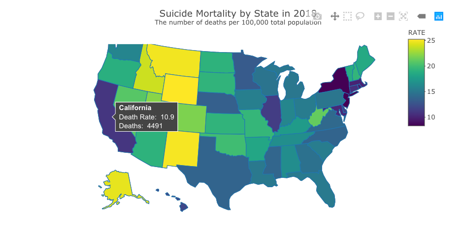

```{r setup, include=FALSE}
knitr::opts_chunk$set(echo = TRUE)
library(tidyverse)
library(lubridate)
library(formattable)
library(DT)
```

## Part 1

### Question 1

Below is a function that ought to return "I'm an even number!" if `x` is an even number. However, we're having trouble receiving a value despite `x == 4`, which we know is an even number. Fix the code chunk and explain why this error is occurring. You will have to change the `eval=FALSE` option in the code chunk header to get the chunk to knit in your PDF.

NOTE: `%%` is the "modulo" operator, which returns the remainder when you divide the left number by the right number. For example, try `2 %% 2` (should equal 0 as 2/2 = 1 with no remainder) and `5 %% 2` (should equal 1 as 5/2 = 2 with a remainder of 1).

```{r, eval=FALSE}
return_even <- function(x){
  if (x %% 2 == 0) {
    return("I'm an even number!")
  }
}

x <- 4
return_even()
```

EXPLAIN THE ISSUE HERE

\newpage

### Question 2

R functions are not able to access global variables unless we provide them as inputs. 

Below is a function that determines if a number is odd and adds 1 to that number. The function ought to return that value, but we can't seem to access the value. Debug the code and explain why this error is occurring. Does it make sense to try and call odd_add_1 after running the function? 

```{r, eval=FALSE}
return_odd <- function(y){
  if (y %% 2 != 0) {
    odd_add_1 <- y + 1
  }
}

return_odd(3)
odd_add_1
```

EXPLAIN THE ISSUE HERE

\newpage

### Question 3

BMI calculations and conversions:
    - metric:   $BMI = weight (kg) / [height (m)]^2$
    - imperial: $BMI = 703 * weight (lbs) / [height (in)]^2$
    - 1 foot = 12 inches
    - 1 cm = 0.01 meter

Below is a function `bmi_imperial()` that calculates BMI and assumes the weight and height inputs are from the imperial system (height in feet and weight in pounds). 

```{r}
df_colorado <- read_csv("data/colorado_data.csv")

bmi_imperial <- function(height, weight){
  bmi = (703 * weight)/(height * 12)^2
  return(bmi)
}

# calculate bmi for the first observation
bmi_imperial(df_colorado$height[1], df_colorado$weight[1])
```

Write a function called `bmi_metric()` that calculates BMI based on the metric system. You can test your function with the Taiwan data set excel file in the data folder, which has height in cm and weight in kg.

```{r}
# your code here

# uncomment the line below to test the bmi calculation on the first row
#bmi_metric(df_taiwan$height[1], df_taiwan$weight[1])
```

\newpage

### Question 4

Can you write a function called `calculate_bmi()` that combines both of the BMI functions? You will need to figure out a way to determine which calculation to perform based on the values in the data.

```{r}
# your code here

# test
# calculate_bmi(df_colorado$height[1], df_colorado$weight[1])
# calculate_bmi(df_taiwan$height[1], df_taiwan$weight[1])
```

\newpage

### Question 5

Use your function `calculate_bmi()` to answer the following questions:

What is the average BMI of the individuals in the Colorado data set? 
```{r}
# your code here
```

What is the average BMI of the individuals in the Taiwan data set?
```{r}
# your code here
```

\newpage

### Question 6

Combine the Colorado and Taiwan data sets into one data frame and calculate the BMI for every row using your `calculate_bmi()` function. Print the first six rows and the last six rows of that new data set.

```{r}
# your code here
```
\newpage

### Question 7

Make a boxplot that shows the BMI distribution of the combined data, separated by location on the x-axis. Use a theme of your choice, put a title on your graph, and hide the y-axis title.

NOTE: These data are for practice only and are not representative populations, which is why we aren't comparing them with statistical tests. It would not be responsible to draw any conclusions from this graph!

```{r}
# your code here
```


\newpage

## Part 2

### Question 8

Recall the patient data from a healthcare facility that we used in Part 2 of Problem Set 7.

We had four tables that were relational to each other and the following keys linking the tables together:

* patient_id: patients, schedule
* visit_id: schedule, visits
* doctor_id: visits, doctors

```{r, echo=F, include=F, results="markup"}
patients <- read_csv("data/patients.csv")
visits <- read_csv("data/visits.csv")
doctors <- read_csv("data/doctors.csv")
schedule <- read_csv("data/schedule.csv")
```

Use a join to find out which patients have no visits on the schedule.
```{r}
# your code here
```

### Question 9

With this data, can you tell if those patients with no visits on the schedule have been assigned to a doctor? Why or why not?

```{r}
# your code here? (optional)
```

YOUR ANSWER HERE

\newpage

### Question 10

Assume those patients need primary care and haven't been assigned a doctor yet. Which primary care doctors have the least amount of visits? Rank them from least to most visits.

```{r}
# your code here
```


\newpage

## Part 3

Recall in Problem Set 5, Part 2, we were working with data from [New York City](https://data.cityofnewyork.us/Health/Children-Under-6-yrs-with-Elevated-Blood-Lead-Leve/tnry-kwh5) that tested children under 6 years old for elevated blood lead levels (BLL). [You can read more about the data on their website]).

About the data:

All NYC children are required to be tested for lead poisoning at around age 1 and age 2, and to be screened for risk of lead poisoning, and tested if at risk, up until age 6. These data are an indicator of children younger that 6 years of age tested in NYC in a given year with blood lead levels (BLL) of 5 mcg/dL or greater. In 2012, CDC established that a blood lead level of 5 mcg/dL is the reference level for exposure to lead in children. This level is used to identify children who have blood lead levels higher than most children's levels. The reference level is determined by measuring the NHANES blood lead distribution in US children ages 1 to 5 years, and is reviewed every 4 years.

\newpage

### Question 11

Load in a cleaned-up version of the blood lead levels data:
```{r}
bll_nyc_per_1000 <- read_csv("data/bll_nyc_per_1000.csv")
```


Create a formattable table (example below) that shows the elevated blood lead levels per 1000 tested across 2013-2016. If the BLL increases from the previous year, turn the text red. If the BLL decreases from the previous year, turn the text green. To accomplish this color changing, you may want to create three indicator variables that check the value between years (e.g. use if_else). If you've have used conditional formatting on excel/google sheets, the concept is the same, but with R. 

Note: If you are using if_else (hint hint) and checking by the year, you will likely need to use the [left quote, actute, backtip](https://www.computerhope.com/jargon/b/backquot.htm#:~:text=Alternatively%20known%20as%20acute%2C%20backtick,keyboard%20key%20as%20the%20tilde.), to reference the variable. 

We have also provided you a function that you can use within your formattable table to reference this indicator variable to help reduce the code. However, you do not have to use this, and feel free to change the hex colors. 

```{r, echo=F}
knitr::include_graphics('data/table_1.png')
```

```{r}
# in the event that plotly was run below, detach plotly
# the option 'style' conflicts when both libraries are loaded
#detach("package:plotly", unload=TRUE)

# your code here

# function that returns red if indicator == 1, green otherwise
up_down = function(indicator) {
  return(ifelse( indicator == 1, "#fd626e", "#03d584"))
}

# your `formattable code` here

```
\newpage

### Question 12

Starting with the data frame `bll_nyc_per_1000` create a table with the DT library showing elevated blood lead levels per 1000 tested in 2013-2016 by borough. Below is an example of the table to replicate.

```{r, echo=F}

```


```{r}
# your code here
```

\newpage

## Part 4

### Question 13

For this question, we will use suicide rates data that comes from [the CDC](https://www.cdc.gov/nchs/pressroom/sosmap/suicide-mortality/suicide.htm). 

Replicate the graph below using plotly. 

```{r, echo=F}
knitr::include_graphics('data/rate_graph.png')
```

```{r, include=F}
# issues with formattable and plotly together since the "style" option overlap
# https://stackoverflow.com/questions/39319427/using-formattable-and-plotly-simultaneously
#detach("package:formattable", unload=TRUE)

library(plotly)
df_suicide <- read_csv("data/Suicide Mortality by State.csv")

# your code here
```

\newpage

### Question 14

Create an [interactive (choropleth) map with plotly](https://plotly.com/r/choropleth-maps/) similar to the one presented on the [CDC website](https://www.cdc.gov/nchs/pressroom/sosmap/suicide-mortality/suicide.htm). On the CDC map you can hover over each state and see the state name in bold, the death rate, and deaths. We can do much of this with plotly. As a challenge, use only the 2018 data to create an interactive US map colored by the suicide rates of that state. When you hover over the state, you should see the state name in bold, the death rate, and the number of deaths. 

Some key search terms that may help: 

* choropleth
* hover text plotly r
* hover text bold plotly r
* plotly and html
* html bold
* html subtitle

Below is an image of an example final map when you hover over California.

```{r, echo=F}

```

Here is the shell of the map to get you started. Copy the plotly code into the chunk below this one and customize it.
```{r message=FALSE, warning=FALSE}
# data pulled from CDC website described above 
df_suicide <- read_csv("data/Suicide Mortality by State.csv") %>%
  filter(YEAR == 2018)

plot_ly(df_suicide,
        type="choropleth",
        locationmode = "USA-states") %>%
  layout(geo=list(scope="usa")) 
```

```{r}
# your code here
```


