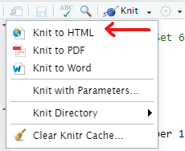
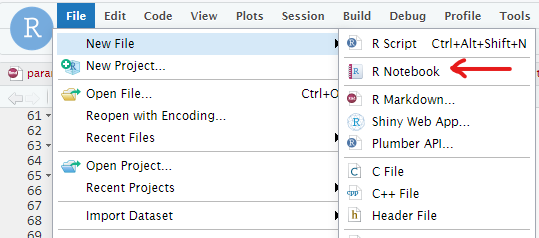

```{r setup, include=FALSE}
knitr::opts_chunk$set(echo = FALSE)
library(readr)
library(dplyr)
library(magrittr)
library(data.table)
library(plotly)
```

# Advanced RMD Topics

- Additional output options
  - HTML - more flexibility compared to pdf
  - Notebooks
  - Slides (ppt, hmtl slidesets, google slides/docs?)
- Parameterized Reports

### All details about Advanced Rmd applications are well documented in [The RMD Definitive Guide by Xie, Allaire, & Grolemund](https://bookdown.org/yihui/rmarkdown/) and [The RMD Cookbook by Xie, Dervieux, & Riederer](https://bookdown.org/yihui/rmarkdown-cookbook/)

---

# HTML Output

- Advantages
  -  Less rigid formatting
  -  Interactive visuals (plotly, leaflet, dt, tabs)
  -  More content with less scrolling
- Disadvantages
  - Files are bigger - more difficult to share
  - Occasional incompatibility across different systems
  
---
 
# HTML Output

### Change YAML to include HTML document
```{}
title: "PHW251 Problem Set 6"
author: "Teaching Team"
date: '2021'
output:
  html_document:
```

.pull-left[
Or select 'Knit to HTML' in the Knit menu and it will insert the html output line in the yaml for you
]
.pull-right[

]

---

# Notebooks

## 
- Special form of Rmd file
- Great for sharing and documenting code
- Much of the special functionality has been incorporated into regular RMDs
- Allows for pre-knit preview (which is really nice)

  
---
 
# Notebooks

### Change YAML to include HTML document
```{}
title: "Code epi analysis approach"
output: html_notebook
```

.pull-left[
Or when creating a new file, choose 'R Notebook' 
]
.pull-right[

]

---

# Slides

- You can knit slide decks from an Rmd file
- Currently five different formats
  - ioslides and Slidy (HTML or pdf via print)
  - Beamer (pdf)
  - Powerpoint
  - xaringan moon-reader (HTML)

## Especially useful if presenting tables or visualizations based on changing data

---
 
# Example Chart

```{r chart, echo = F, message = F, warning=F, fig.width=11}
covid_df <- read_csv("https://data.chhs.ca.gov/dataset/f333528b-4d38-4814-bebb-12db1f10f535/resource/046cdd2b-31e5-4d34-9ed3-b48cdbc4be7a/download/covid19cases_test.csv") %>%
  filter(area_type == "State") %>%
  mutate(case_roll = frollsum(cases, 7, hasNA = T)/7,
         test_roll = frollsum(total_tests, 7, hasNA = T)/7
         )

        fig1 <- plot_ly(data = covid_df) %>%
            add_trace(x = ~date, y = ~cases, type = 'bar', name = 'Cases per day',
                                     marker = list(color = 'rgb(187, 216, 228)'),
                                     hoverinfo = "text",
                                     text = ~paste(round(cases, 0), ' cases')) %>%
             add_trace(x = ~date, y = ~case_roll, type = 'scatter', mode = 'lines', name = 'Average Cases', 
                                     line = list(color = '#345B6B'),
                                     hoverinfo = "text",
                                     text = ~paste(round(case_roll, 1), ' average cases')
             ) %>% 
            layout(legend = list(x = 0.1, y = 0.9))
        
        fig1
        
```

---

# Parameterized Reports

## Parameterized reports allow you to create a single report for multiple audiences or purposes

- Including the 'params' option in the YAML allows you to 
  - Specify filters 
  - Change content 
  - Otherwise customize reports 

---

# Interactive Parameterized Reports

## Interactive parameterized reports takes this one step further

- Create a simple interface that lets a user choose the parameters before the report is knitted.
- Instead of supplying the parameters in the YAML, you instead define inputs

## 

---
