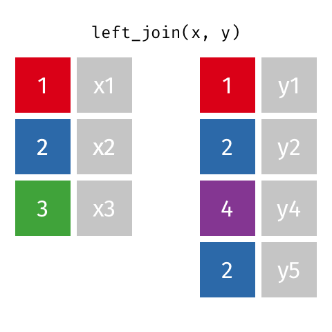

```{r setup, include=FALSE}
knitr::opts_chunk$set(echo = TRUE)
```


It is common that your analysis involves multiple sources of data, and the linkage of multiple datasets. 

Perhaps you need to connect laboratory data to patient clinical outcomes, or Google mobility data to infectious disease trends, or even a dataset at one stage of analysis to a transformed version of itself.

In this lab we demonstrate code to conduct joins of relational data such that rows are matched based on common values in identifier columns.


## Preparation

```{r load, message=FALSE, warning=FALSE}
# load tidyverse
library(tidyverse)
```

- To begin, we import the cleaned linelist of cases from a simulated Ebola epidemic. It's a big dataset and we only include 10 rows and 4 columns in our exercise.

```{r cases, message=FALSE, warning=FALSE}
# load and create dataset
library(rio)
cases <- import("linelist_cleaned.rds") %>%   # start with original linelist
  select(case_id, date_onset, date_hospitalisation, hospital) %>%   # select columns
  head(10)                                    # only take the first 10 rows
cases
```

- Hospital information data frame
  - Below is the code to create a separate data frame with additional information about hospitals (the catchment population, and the level of care available). 
  

```{r hosp_info, message=FALSE, warning=FALSE}
hosp_info <- data.frame(
  hosp_name     = c("Central hospital", "Military Hospital", "Port Hospital", "St. Mark's Maternity Hospital (SMMH)", "Ignace Hospital", "Sisters Hospital"),
  catchment_pop = c(1950280, 40500, 50280, 12000, 5000, 4200),
  level         = c("Tertiary", "Primary", "Secondary", "Secondary", "Primary", "Primary")
)
hosp_info
```

- In the joining section below, we will use the following datasets:

  - 1. A “miniature” version of the case linelist, containing only the columns case_id, date_onset, and hospital, and only the first 10 rows

  - 2. A separate data frame named hosp_info, which contains more details about each hospital


## Types of joins

|Function    |Return              |
|:-----------|:-------------------|
|inner_join()|all rows that match key values in x and y|
|left_join() |all rows in x and in y that match|
|right_join()|all rows in y and in x that match|
|full_join() |all rows in x and y|


- **Exercise 1**: Explore the mean time from symptom onset to hospitalization among the hospital we have further information.

```{r}

```


### Inner_join

- An inner join is the most restrictive of the joins - it returns only rows with matches across both data frames `x` and `y`.

- Animated example of an inner join (Many thanks to https://github.com/gadenbuie for the informative gifs!)


- **Exercise 2**: Use `left_join()` to explore types of care the patients received.

```{r}

```


### Left Join

- All rows from `x`, and all columns from `x` and `y`. Rows in `x` with no match in `y` will have `NA` values in the new columns.


- ... If there are multiple matches between `x` and `y`, all combinations of the matches are returned.


- Add one more hospital in our `hosp_info` dataset. Note that the name “Military Hospital” belongs to two different hospitals - one a primary level serving 40500 residents and the other a secondary level serving 10000 residents.

```{r}
hosp_info2 <- data.frame(
  hosp_name= "Military Hospital",
  catchment_pop = 10000,
  level         = "Secondary"
) %>% rbind(hosp_info)
hosp_info2
```

- **Exercise 3**: Apply `left_join()` to the new hospital information and compare the output.

```{r}

```


- **Exercise 4**: Use `right_join()` to calculate the number of cases in hospital and the hospitalization rate in each catchment area.

```{r}

```


### Right Join

- All rows from y, and all columns from `x` and `y`. Rows in `y` with no match in `x` will have `NA` values in the new columns.


- **Exercise 5**: Apply `full_join()` and keep the most of information.

```{r}

```


### Full Join

- All rows and all columns from both `x` and `y`. Where there are not matching values, returns `NA` for the one missing.


## Exercise with flight data

```{r}
library(nycflights13)
head(flights)
head(planes)
head(airports)
```


- **Exercise 6**: Is there a relationship between the age of a plane and its departure delay (`dep_delay` in `flights` dataset)? Calculate the mean for each age of a flight and create a two-dimensional plot of points to show the relationship.

```{r}
# your code here
```


- **Exercise 7**: Compute the average delay (`arr_avg_delay`) by destination (`arr_delay` in `flights` dataset), then join on the `airports` data frame so you can show the spatial distribution of delays. Here’s an easy way to draw a map of the United States:

```{r}
# your code
avg_dest_delays <- 


# use following code to plot  
avg_dest_delays %>%
  ggplot(aes(lon, lat, colour = arr_avg_delay)) +
  borders("state") +
  geom_point() +
  coord_quickmap()
```


## Bonus: Filtering Joins

- Filtering joins match observations in the same way as mutating joins, but affect the observations, not the variables.
- ... Semi-joins are useful for matching filtered summary tables back to the original rows.
- ... Anti-joins are useful for diagnosing join mismatches.  
- [R for Data Science: Filtering Joins](http://r4ds.had.co.nz/relational-data.html#filtering-joins)

### Semi Join

- All rows from `x` where there are matching values in `y`, keeping just columns from `x`.


### Anti Join

- All rows from `x` where there are not matching values in `y`, keeping just columns from `x`.

