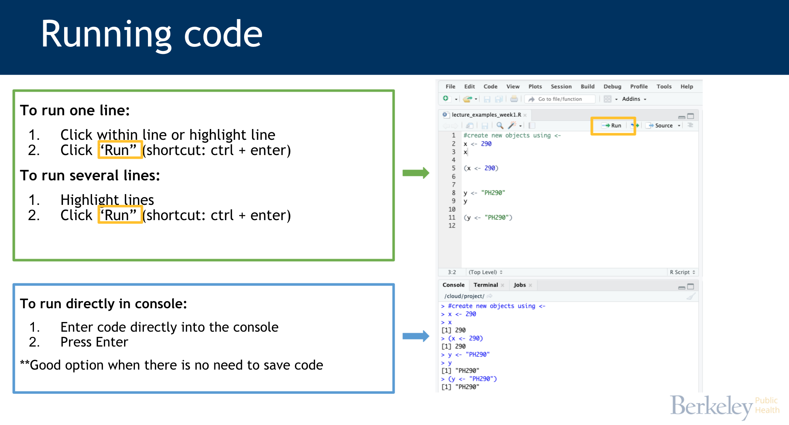
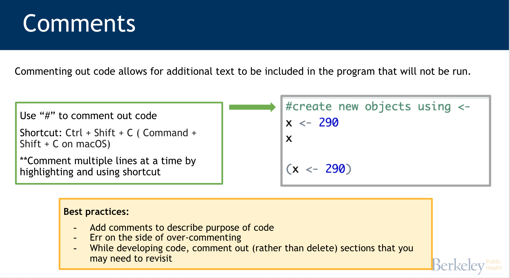
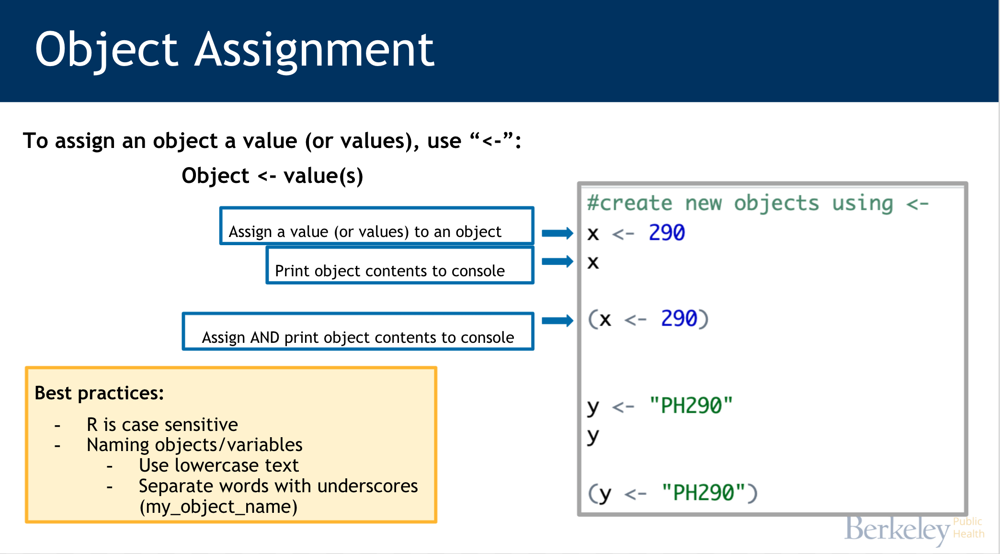
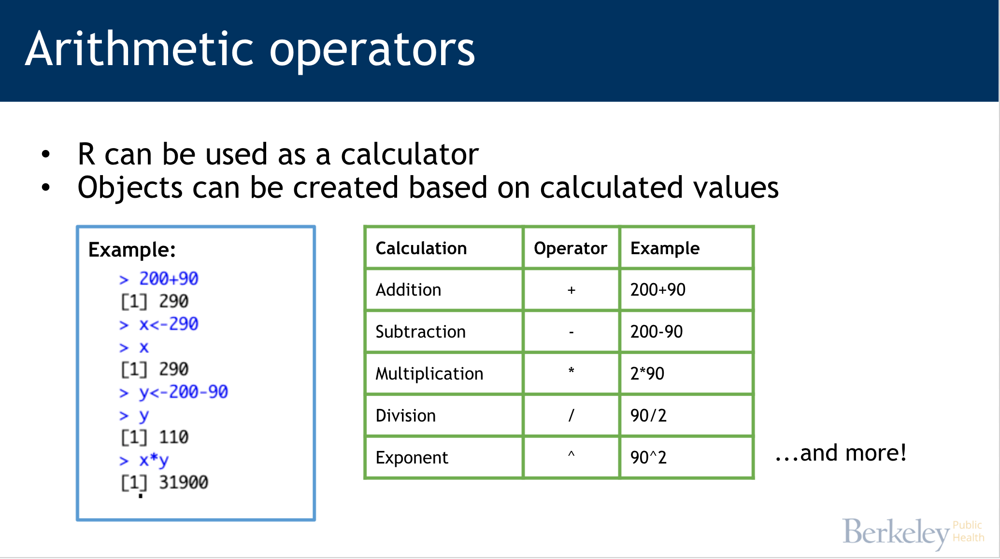
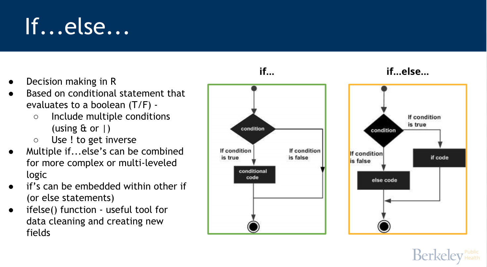
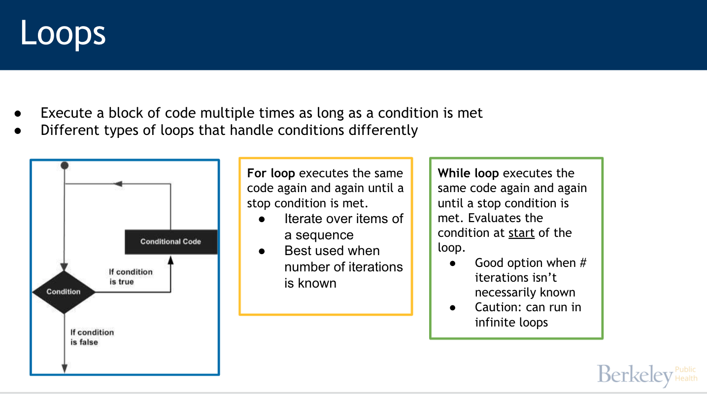

```{r setup, include=FALSE}
knitr::opts_chunk$set(echo = TRUE)
```

## Foundations of Programming

### Using R


```{r run_code}

2 + 3

2 + 2

```


```{r comments}
#this is a comment

# this is another comment

# this
# is
# several
# comments

# 2 + 4

```


```{r assign}

x <- 500
x

(y<-39+23)

current_month <- "August"

```

### Programming concepts




```{r calculator}
a <- 200
b <- 90

a/b

b^2

new_calc <- a * b

```


```{r boolean}

a <- 2
b <- 7
x <- 1000
y <- 999

a==b

x==y

x<y
a<b

x<y & a<b
x<y | a<b

c <- "hi"
d <- "hello"

c == d

#using %in% 
v <- c("Monday","Tuesday","Wednesday")

"Friday" %in% v

condition_met <- "Friday" %in% v


```


```{r ifs}
##if code structure

# if(condition){
#    if code     
# }

##ifelse code structure 

# if(condition){
#    if code     
# } else if(condition){
#   else code
# } else{
#   else code
# }

day <- "Friday"

if(day=="Sunday"){
  print("Run weekly report")
} else if(day %in% v){
  print("Run SHORT daily report")
} else{
  print("Run FULL daily report")
}

#numeric
case_rate <- 45
risk <- "low"

if(case_rate>50){
  risk <- "high"
} else if(case_rate>25){
  risk <- "medium"
} else{
  risk <- "low"
}

#ifelse(condition, if TRUE, if FALSE)
case_rate_gp <- ifelse(case_rate>50,"high","low")


```

Examples of practical applications:
+ Specifying a chunk of code that should only be run on a certain day (e.g. perhaps you want a weekly summary produced every Friday)
+ Creating new columns based on conditions (using ifelse() function)



```{r loops}
#for
#example
v <- LETTERS[1:4]

for ( i in v) {
   print(i)
}

#example
county <- c("Alameda","Contra Costa","Sacramento")
case_rate <- c(54,23,46)

for (i in 1:length(county)){
   print(paste0(county[i]," case rate: ",case_rate[i]))
}


#while
count <- 1

while (count < 7) {
   print(paste0("Hello, this is round ",count))
   count <- count + 1
}


#how they differ 
counter <- 1

while(counter <= 10) {
        print(counter)
        counter <- counter + 1
}

# this for loop provides the same output
counter <- vector(mode = "numeric", length = 10)

for(i in 1:length(counter)) {
        print(i)
}

for(i in 1:10) {
        print(i)
}


```

Examples of practical applications:
- Generating a value or report for each county in CA 
- Read in multiple files
- Simulations

